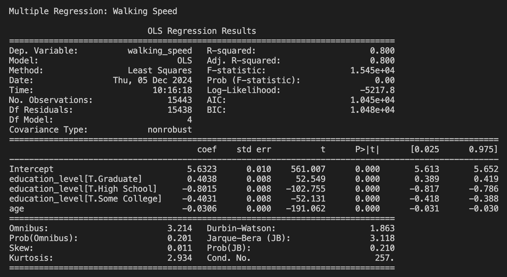
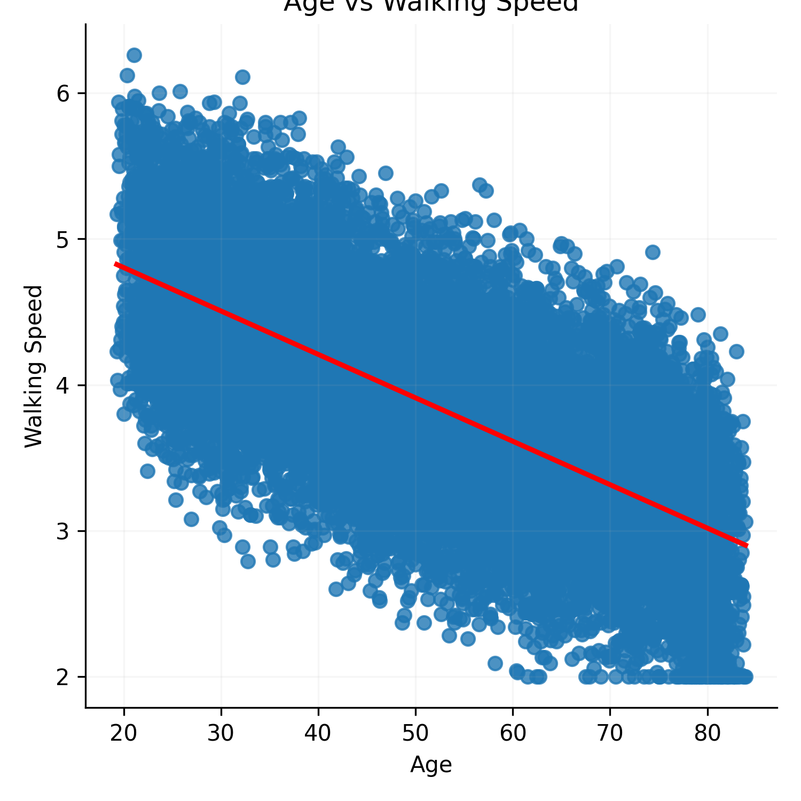

## DATASCI 217 - Final Exam: Multiple Sclerosis Analysis

### Question 1: Data Preparation with Command-Line Tools
To generate the raw data (ms_data_dirty.csv), I ran generate_dirty_data.py. 
Preparing the data involved removing comment lines, empty lines, and extra commas. This effort required the use `grep` and `sed`.
 The cleaning process also involved using `cut` to extract essential 
columns including patient_id, visit_date, age, education_level, and walking_speed. 
The shell script generates a file insurance.lst containing the different 
insurance types (Basic, Premium, Platinum). There are 15443 rows and the first 5 rows of data is shown below:

| Patient   | Visit Date   | Age   | Education Level | Walking Speed |
|-----------|--------------|-------|-----------------|---------------|
| P0001     | 2020-02-24   | 74.77 | High school     | 2.35          |
| P0001     | 2020-08-09   | 75.26 | High school     | 2.67          |
| P0001     | 2020-11-20   | 75.54 | High school     | 2.54          |
| P0001     | 2021-03-05   | 75.82 | High school     | 2.81          |
| P0001	    | 2021-05-31   | 76.06 | High school     | 2.15	     |

### Question 2: Data Analysis with Python
In this portion, patients were randomly assigned an insurance plan. Insurance type informed the visit costs where Basic = 75, Premium = 100, and Platinum 
= 150. Summary statistics were also outputted as shown by the tables below.
1. This table displays the average walking speed by education level. Those with a high school level education have the slowest walking 
speed, whereas those with a graduate level education have the fastest walking speed.

| Education Level | Mean Walking Speed |
|-----------------|--------------------|
| Bachelors       | 4.026176           |
| Graduate        | 4.444103           |
| High School     | 3.278720           |
| Some College    | 3.644946           |

2. This table shows the mean visit costs by insurance type.

| Insurance Type  | Mean Visit Costs   |
|-----------------|--------------------|
| Basic           | 75.000571          |
| Premium         | 100.134323         |
| Platinum        | 149.828682         |

3. This table is the age effects on walking speed. Younger patients have the fastest walking speed and older patients have much slower 
walking speeds. Additionally, the correlation between walking speed and age (using the corr() function) resulted in a value of 
-0.670, indicating a moderate negative correlation where as age increases, walking speed decreases.

| Age Group       | Mean Walking Speed |
|-----------------|--------------------|
| 18-35           | 4.569382           |
| 36-50           | 4.116612           |
| 51-65           | 3.676329           |
| >65             | 3.228023           |

### Question 3: Statistical Analysis 
- Analyzing walking speed
A multiple regression model of walking speed with relation to education and age was formulated and analyzed. 
This model produced an adjusted R-squared value of 0.8, meaning 80% of variance in walking speed is explained by education and age. 

- Analyzing costs
An ANOVA analysis was conducted on the effect of insurance type on visit costs. The F-statistic was 74105.314 suggesting that insurance 
type has a significant impact on visit costs and there are significant differences between the group means.
Below is the summary statistics and boxplot visualizing this effect.

- Advanced analysis
To understand the interaction effect of education and age on walking speed, a mixed linear model was formulated (walking_speed ~ 
education_level * age). The summary of the model fit is shown below:

This image shows that both age and education have a signifcant role in walking speed, however, the interactions between age and education 
levels does not significantly alter the results. This means that age affects walking speed similarly, regardless of education level.

### Question 4: Data Visualization
The visualizations were created in Jupyter notebook using the seaborn and pyplot packages. 
1. Walking speed
This scatterplot displays the effect of age on walking speed. As age increases, walking speed declines.

The boxplots below show how walking speed differs between education levels. Higher levels of education have greater 
walking speeds.

The lineplot highlights the effect of education level on walking speed.

2. Cost analysis
The barplot of mean costs by insurance type show that higher tiered insurance plans have higher visit costs. This is 
further exemplified in the boxplot of cost distributions.

3. Combined visualizations
The pairplot compares age, walking speed, and visit cost faceted by insurance type.

Time series on walking speed and visit costs display the trends over time in the plots below.

